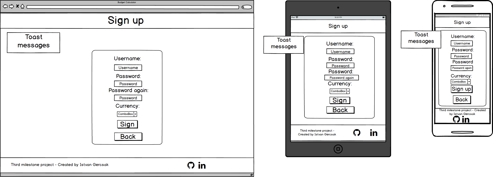
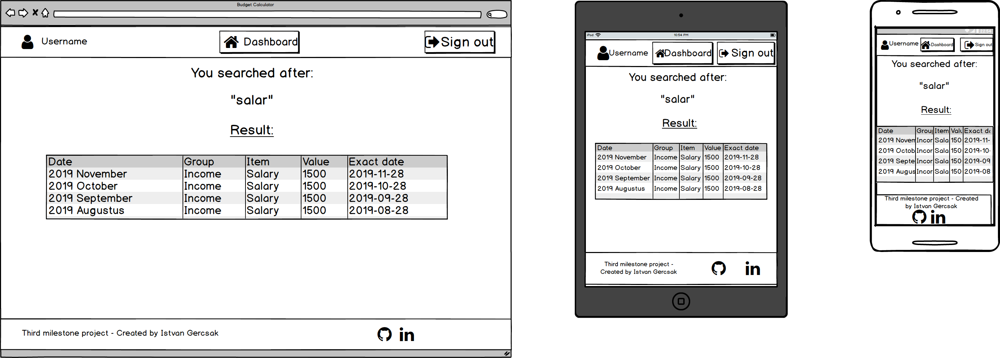
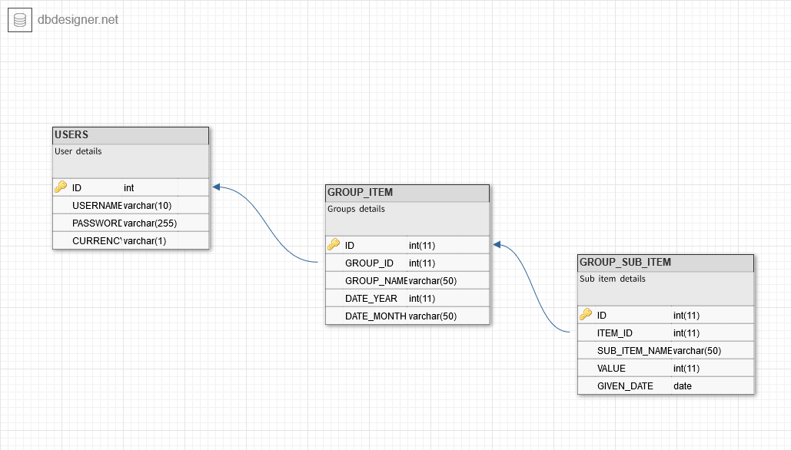

# Budget Calculator - Third Milestone Project

[View my project](https://budgetcalculator-thirdproject.herokuapp.com)

This website was made as my second Milestone project at [Code Institute](https://codeinstitute.net/).
The main goal was to create full stack web application and follow the newest UX/UI principles and create different 
layers thereby as a user I can store/modify and reach data from remote database. 
The idea was to create a budget calculator and with its help we can handle our financial more consciously. 
With the use of the application we can register ourselves
and log into the application. To increase the security for the users and hide theirs financial and personal details 
from the public the passwords are stored encrypted and the users using cookie session as well.
We can add/edit/remove groups and items and search after the given items. 
We can see our Income/Expanse ratio on a colorful graphs which is shows to the user the ratio of their income and expense with 
transparently.

## UX

### Colors

I empathise this part because in this way I can control the users' attention
    
   - Backgrounds 
        - On chosen color Blue shade background
        - White navigation bar and footer
        - Silver and black font colors
   - Buttons (Consistent buttons with white fonts)
        - Green button
            - Log in
            - Add functionality
        - Yellow button
            - Edit functionality
        - Red button
            - Sign out buttons
        - Gray button (Navigation or cancellation buttons)
   - Pop up:
        - Green background for Add functionality 
        - Yellow background for Edit functionality
        - Red background for Remove/Delete functionality
   - Toast
        - Informative and error messages
   - Chart
        - Colorful chart
        - Change the color every time when the page is loading
   - Numbers
        - Green color for the positive numbers
        - Red color for the  negative numbers
   - Tables
        - Black striped tables with white fonts
        
### Icons

I imported icons from the [font awesome](https://fontawesome.com/) 

- Icons
    - User icon
        - Next to the username field
        - Next to the username inside the application
    - Key icon
        - For password
    - Home icon
        - Navigate on the Dashboard page
    - Sign out icon
        - Sig out
    - Modification icons
        - Plus icon for Add new group/item
        - Edit icon for edit group/item
        - Trash icon for delete/remove groups/items
    - Glass Icon
        - Search functionality

### Responsive
   
The application is convenient to use on every resolution (Mobile/Tablet/PC)

### Mockup
#### Front end Mockup

- **Created with [Balsamiq Mockups 3](https://balsamiq.com/) that is a user interface design tool**
    - **Log in page**:
    
    - **Sign up page**:
    
    - **Dashboard page**:
    
    - **View details page**:
    
    - **Search result page**:
    

#### Database Mockup

- **Created with [dbdesigner](https://www.dbdesigner.net/):**
    - **Database schema**:
     

### User Stories

#### Responsiveness

- As a user, I want to use the website on Pc, Tablet and Mobile Phone so that on different devices it will work with the same functionality.
- As a user, on the mobile resolution I want to see only icons in the tables

#### Alert messages

- As a user I want to see alert messages if:
    - I create something
    - I edit something
    - I delete something
    - Something is not possible

#### Order dates

- As a user, I want to see my dates by descending
    - On the Dashboard page
    - On the View details page
    - On the Search result page

#### UI/UX

- As a user, I want to see the favicon on every page
- As a user, I want to see the pop ups with different colors
- As a user, I want to see toast message
    - If I do a modification
    - If there is a problem with the modification
- As a user, I want to see my currency on every page

#### Other

- As a user, I want to get feedback if
    - Sign up:
        - The username is used by somebody else
        - I could sign up
    - Log in:
        - I give a wrong username or password
        - I logged in
    - Log out:
        - I logged out
    - Create:
        - New group item
        - New sub group item
        - There is an existing year-month-group combination exist under the username 
    - Edit:
        - Group item
        - There is an existing year-month-group combination exist under the username
        - The actual group contains sub item(s)
        - Sub group item 
    - Delete:
        - Group item
        - There is an existing year-month-group combination exist under the username
        - Sub group item    
- As a user I want see the Incomes in green
- As a user I want see the Expenses in red
- As a user I want see the Zero balance in blank

#### Database

- As a user, I want to store the data into the database so I can reach the data later on

#### Security

- As a user, I want to store my password encrypted
- As a user, I want to use cookie session
- As a user, I want to be dropped out from the application if I close the actual browser
- As a user, I don't want to see my username on the url

#### Sign Up
  
- As a user, I want to sign up for the page so I can log in into the application
- As a user, I want to give my username, password currency during the registration
- As a user, I want to check whether
- As a user, I want to give my currency from the given list
    - The username is unique and get back toast message
    - The username character is more than 5 character and get back error message
    - The username character is more than 9 character and get back error message
    - The given two password is the same or not, if not I want to get back toast message
- As a user, I want to get back JavaScript alert about the redirection to the login page after the successful sign up     
     
     
#### Log In

- As a user, I want to log in with the application with my details
- As a user, I want to get back feedback if the username or password is not correct 

#### Log out

- As a user, I want log out from the application with the Sign out button
- As a user, I want the cookie to be deleted after the 

#### Add new group item

- As a user, I want to add a new group item

#### Edit group item

- As a user, I want to edit a group item

#### Delete group item

- As a user, I want to delete item

#### Add new sub group item

- As a user, I want to add a new sub group item

#### Edit sub group item

- As a user, I want to edit a group item 

#### Delete sub group item

- As a user, I want to delete a sub group item

#### Search functionality

- As a user, I want to search after my sub items 

#### Summarize

- As a user, I want to see my balance based on my groups
- As a user, I want to see my savings

#### Charts

- As a user, I do not want to see chart if I don't have any group
- As a user, I want to see the charts based on my group sum value
- As a user, I want to see my charts with different colors after every page loading

## Features

Demo page where I test the features from Data Centric Development lecture and copied my code to here:
[link](https://github.com/IstvanGercsak/PythonAndMySQLPractice)

### Existing Features

- Responsive web application
- Sign up with user
- Login up with user
- Logout with user
- Password checking whether we give the same password in the Sign up page
- Cookie session handling 
    - Login:
        - Create active cookie session 
    - Logout:
        - Delete active cookie session
- Store data in Database
- Encrypt password and store it in database
- Decrypt encrypted password from database
- Summarize Balance
- Summarize each groups
- Summarize Sub items
- Add new group
- Edit existing group
- Remove Existing group
- Add new sub item
- Edit existing sub item
- Remove Existing sub item
- Charts
- Uniqueness
    - Unique username
    - Unique group name 
- Search functionality
- Show available balance
- Show savings

### Features Left to Implement

- We get back estimation about how much money we have if we continue the saving or spending
- There is no Tutorial site as the project description is enough to understand the goal of the project
- There is no user page where the user can handle its data
- Password reset in that case because it is not belongs to this project scope

## Technologies Used

- [HTML5](https://www.w3.org/html/)
    - Hypertext Markup Language is the standard markup language for creating web pages and web applications.
- [CSS3](https://www.w3.org/Style/CSS/)
    - Cascading Style Sheets is a style sheet language used for describing the presentation of a document written in a 
    markup language like HTML.
- [BootStrap 4.3.1](https://getbootstrap.com/docs/3.3/)
    - Front End Framework for developing responsive websites.
- [JavaScript](https://developer.mozilla.org/en-US/docs/Web/JavaScript)
    - JavaScript is a lightweight interpreted or just-in-time compiled programming language with first-class functions. While it is most well-known as the scripting language for Web pages.
- [JQuery 3.4.1](https://jquery.com)
    - The project uses to simplify DOM manipulation.
- [Git](https://git-scm.com/)
    - Git is a distributed version-control system for tracking changes in source code during software development.
- [GitHub](https://github.com/)
    - GitHub Inc. is a web-based hosting service for version control using Git.
- [Flask](https://palletsprojects.com/p/flask/)
    - Flask is a micro web framework written in Python. It is classified as a microframework because it does not require particular tools or libraries. It has no database abstraction layer, form validation, or any other components where pre-existing third-party libraries provide common functions
- [Python](https://www.python.org/)
    - Python is an interpreted, high-level, general-purpose programming language
- [Heroku](https://www.heroku.com/)
    - Heroku is a platform as a service (PaaS) that enables developers to build, run, and operate applications entirely in the cloud
- [MySQL server](https://www.mysql.com/)
    - MySQL is an Oracle-backed open source relational database management system (RDBMS) based on Structured Query Language (SQL)
    - [RemoteMySQL](https://remotemysql.com) is a Free Remote MySQL server
- [Jinja2](https://palletsprojects.com/p/jinja/)
    - Jinja is a web template engine for the Python programming language. Jinja2 is a modern and designer-friendly templating language for Python, modelled after Django's templates.

## Testing

You can find the testing document in the [Testing.md](https://github.com/IstvanGercsak/BudgetCalculator-ThirdMileStoneProject/blob/master/Testing.md) file.

## Deployment

How I implement this project:

Firstly I built the basic functionality one of my private repository until I get the first working version of website. 
After this I copied the code snippets in this public repository, and explained the actual small pieces of the commits in the commit comment section.

- **Set up**:
    - I use local IDE for create the project, I installed the Git locally and synchronized my local IDE 
    with the local git. I use IntelliJ Pycharm for the front end development with its helpful built in deployment tools. 
    After I created a Git and GitHub repository, I could start to work and I could test my features locally.
    I could see my changes locally to open my index.html file with the View/Open browser menu option in my local IDE.
    Here I could choose the required browser which I want to use. (Chrome, Mozilla, etc.)
- **Commits**:
    - After every small piece and increment, I made commit to my local Git repository. After that in the end of the 
    bigger section that gives value to my project I pushed my modification to my online GitHub repository.
    - For the development I only use one branch called "master".
- **Local and online deployment**
    - Locally: It is very easy to clone repository from my account if you follow these steps:
        1. Follow this link [Project GitHub repository]() 
        2. Under the repository name, click "Clone or download".
        3. Here you have to copy the url's of the repository
        4. In your local IDE you can choose to create new project from version control/Git 
        5. Paste the link there that you copied before
        6. For additional help you can more information under this [link](https://help.github.com/en/articles/cloning-a-repository)
    - Online: (Need to expand)
        1. I used Heroku:
        2. Create project with unique name
        3. I choose the project and under the Deploy tab I connect the github project where the source code are
        4. Set the deployment to Autodeploy so after every commit there will be a new deployment into Heroku.
        5. Create requirements.txt file: pip freeze > requirements.txt (In this way the Heroku will know what kind of extensions should be installed)
        6. I set the Config Vars under the Settings (IP=0.0.0.0 and PORT=5000)
        7. The application up and running and available under this [link](https://budgetcalculator-thirdproject.herokuapp.com)
        
        
## ToDO
### User stories
### Testing documentations   